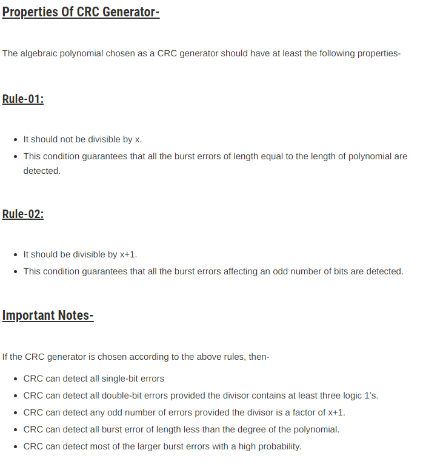

# cyclic-redundancy-check

A cyclic redundancy check is an error-detecting code commonly used in digital networks and storage devices to detect accidental changes to raw data. Blocks of data entering these systems get a short check value attached, based on the remainder of a polynomial division of their contents.

# Demo 
[live Demo](https://asecuritysite.com/comms/crc_div?a=101110&b=1001)

[Python code](main.py)

# Learing part 

# reference 
- asecuritysite
- gatevidyalay
